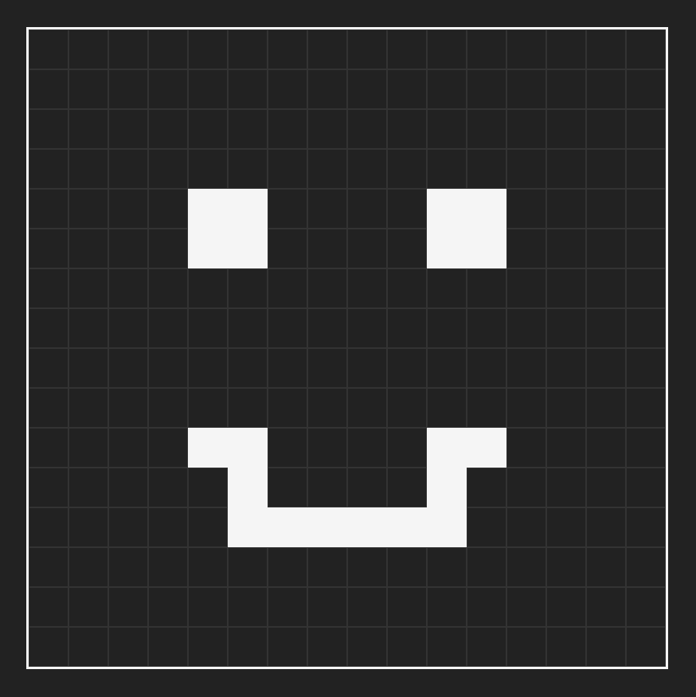

# JavaScript Etch-A-Sketch

## Go ahead. Draw some pixels.

Monochrome Microsoft Paint in your browser, anyone?

This is an exercise from Social Hackers Academy where I learned more about DOM manipulation using JavaScript, as well as the flexibility of CSS grid.
 

## Instructions:

Hold and drag the left mouse button to draw. "Reset" empties out the canvas while "Resize" allows you to change the "resolution" of the canvas, meaning how many pixels per side you want it to be.

<a href="https://hjp-etch.netlify.app/" target="_blank">Try it out!</a>

## Issues / TO-DO:

Implementing an eraser would be useful and interesting. Probably works best for resolutions higher than 1080p.
